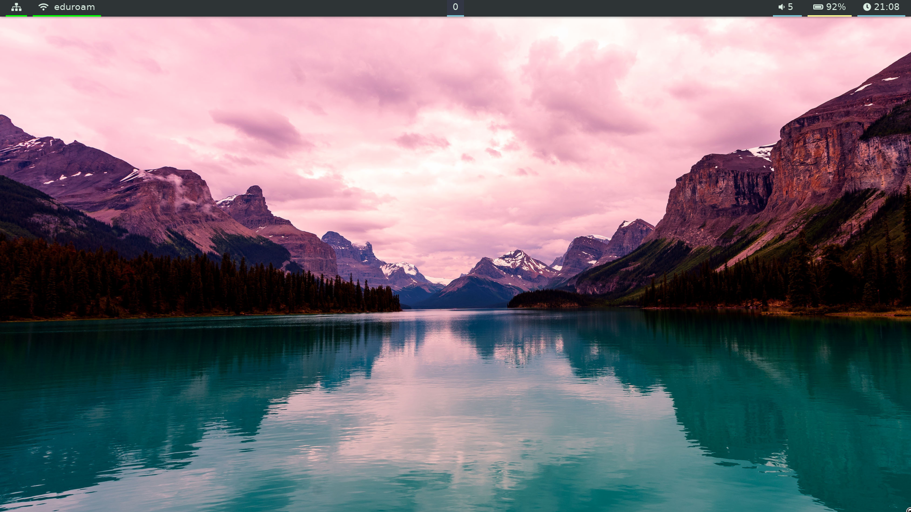

# i3-gaps

# i3-gaps info

- Window Manager - i3-gaps
- Wallpaper - https://alpha.wallhaven.cc/wallpaper/691676
- Taskbar - https://github.com/polybar/polybar
- Menu - https://github.com/davatorium/rofi
- Custom Notifications Display - Check scripts/yanotify and polybar configs